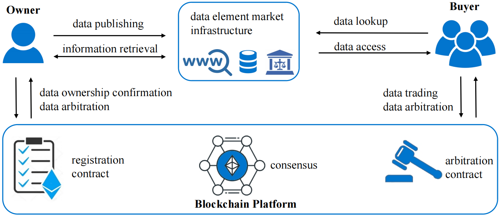

# Scalable and Dynamic Data Ownership Confirmation

Data ownership confirmation is a prerequisite for trustworthy data circulation.
Existing blockchain-based schemes often register each data item independently,
which leads to linear on-chain storage cost and poor support for dynamic updates.
This project implements a scalable data ownership confirmation and arbitration
scheme for large, heterogeneous, and frequently updated datasets.

The core idea is to model ownership confirmation as an authenticated data
structure problem. A data owner commits to an entire dataset with one compact
root hash on chain, while membership proofs for individual data items are
generated off chain and verified by smart contracts when arbitration is needed.

This repository contains the experimental implementation used to evaluate the
proposed scheme.

## System Model

<figure>
  <p align="center">
    
  </p>
  <p align="center">Figure 1: System model</p>
</figure>

The system includes the following entities.

- Data owner: organizes a large dataset, builds the off-chain authenticated data
  structure, registers the dataset root on chain, and generates ownership proofs
  for disputed data items.
- Data elements market infrastructure: provides data publishing, data search,
  compliance review, and certificate/arbitration support.
- Blockchain and smart contracts: maintain the registered dataset root and
  verify submitted ownership proofs in a public and tamper-resistant manner.
- Data consumer and arbitration process: use the on-chain verification result as
  credible evidence in ownership disputes.

## What We Do

- We build a layered authenticated data structure for large heterogeneous
  datasets. Data items are first grouped by type, stored in hash tables, and then
  authenticated by Merkle subtrees.
- We aggregate all subtree roots into one top root, so the blockchain only needs
  to store a constant-size commitment for the whole dataset.
- We support dynamic insert, update, and delete operations by locally updating
  the affected hash table and Merkle subtree.
- We generate membership proofs for individual data items and provide Solidity
  contract source code for root registration and layered proof verification.
- We provide synthetic and preprocessed real-dataset benchmarks for evaluating
  construction time, proof generation time, verification time, update time, and
  storage overhead.

## Reproduce

This section explains how to reproduce every data table and figure reported in
the paper: Table III and Figures 4--6. Run all commands below from the
repository root. The raw real-world datasets are not redistributed in this
repository; download them from their original sources under their respective
licenses.

The off-chain experiments require Go 1.21 or later. Install the Go module once:

```bash
go mod download
```

The plotting scripts require Python 3 with `matplotlib` and `numpy`:

```bash
python3 -m venv .venv
source .venv/bin/activate
pip install matplotlib numpy
```

The off-chain results are wall-clock measurements, and therefore vary with CPU,
memory, Go version, and concurrent scheduling. The parameters and measurement
protocol below match the paper; the source data used to draw the published
figures are retained in the corresponding `draw/figure*.py` files.

### Table III: On-Chain Gas Cost

Table III is reproduced on a local Hardhat network. It requires Node.js 20.x
(see `.nvmrc`) and npm, but does not require an RPC endpoint, private key, or
raw dataset download.

```bash
npm ci
npm run reproduce:table3
```

The command starts from a clean Hardhat build state, compiles the contracts,
deploys `SCReg` and `SCArb`, and measures deployment, registration, root update,
and `verifyOwnershipLayered` gas consumption. It writes the machine-readable
report and rendered table to:

```text
reproduction/table-iii-gas.json
reproduction/table-iii-gas.md
```

The verification cases are exactly the eight $(N,m)$ settings reported in the
paper:

```text
(10,000, 10), (100,000, 10), (1,000,000, 10), (2,000,000, 10),
(5,000,000, 10), (5,000,000, 5), (5,000,000, 20), (5,000,000, 50)
```

For each case, the script applies the Go implementation's load factor
$\alpha=0.75$, derives the power-of-two per-category hash-table capacity,
and constructs a deterministic membership-proof calldata of the corresponding
Merkle height. It then sends that calldata to the local EVM and reads the
transaction receipt's `gasUsed`; it does not pretend to place $N$ raw files on
chain. The ETH and USD columns use the fixed values in the paper, 1.61 Gwei and
3158.53 USD/ETH, rather than current mainnet fees.

Run the contract behavior tests with:

```bash
npm test
```

The tests cover deployment, registration, in-place root updates, expiry,
valid layered proofs, and rejection of altered proofs. See
[REPRODUCIBILITY.md](REPRODUCIBILITY.md) for the complete pinned environment
and fixture specification.

### Figure 4: Performance on Real-World Datasets

Figure 4 uses three public datasets. Download the following original releases:

- **MS COCO 2017:** the [official download page](https://cocodataset.org/dataset/detection-2017.htm), or the direct archives [train2017](https://images.cocodataset.org/zips/train2017.zip), [val2017](https://images.cocodataset.org/zips/val2017.zip), [test2017](https://images.cocodataset.org/zips/test2017.zip), and [train/val annotations](https://images.cocodataset.org/annotations/annotations_trainval2017.zip).
- **CLEVR v1.0:** the [official CLEVR page](https://cs.stanford.edu/people/jcjohns/clevr/) or its [v1.0 archive](https://cs.stanford.edu/people/jcjohns/clevr/CLEVR_v1.0.zip).
- **LibriSpeech:** the [official OpenSLR SLR12 page](https://www.openslr.org/12) or [train-other-500](https://www.openslr.org/resources/12/train-other-500.tar.gz).

The following macOS/Linux commands download the exact releases used in the
paper. `curl -C -` resumes an interrupted download. The downloads total roughly
75 GB; retaining both the archives and their extracted contents requires about
twice that space, so download them only when reproducing Figure 4.

```bash
# MS COCO 2017: train, validation, test, and train/validation annotations.
mkdir -p datasets/coco2017
cd datasets/coco2017
curl -fL --retry 3 -C - -O https://images.cocodataset.org/zips/train2017.zip
curl -fL --retry 3 -C - -O https://images.cocodataset.org/zips/val2017.zip
curl -fL --retry 3 -C - -O https://images.cocodataset.org/zips/test2017.zip
curl -fL --retry 3 -C - -O \
  https://images.cocodataset.org/annotations/annotations_trainval2017.zip
unzip train2017.zip
unzip val2017.zip
unzip test2017.zip
unzip annotations_trainval2017.zip
cd ../..

# CLEVR v1.0.
mkdir -p datasets
curl -fL --retry 3 -C - \
  -o datasets/CLEVR_v1.0.zip \
  https://cs.stanford.edu/people/jcjohns/clevr/CLEVR_v1.0.zip
unzip datasets/CLEVR_v1.0.zip -d datasets
mkdir -p datasets/clevr
mv datasets/CLEVR_v1.0/images/train datasets/clevr/train
mv datasets/CLEVR_v1.0/images/val datasets/clevr/val
mv datasets/CLEVR_v1.0/images/test datasets/clevr/test
mv datasets/CLEVR_v1.0/scenes datasets/clevr/scenes
mv datasets/CLEVR_v1.0/questions datasets/clevr/questions

# LibriSpeech train-other-500.
curl -fL --retry 3 -C - \
  -o datasets/train-other-500.tar.gz \
  https://www.openslr.org/resources/12/train-other-500.tar.gz
tar -xzf datasets/train-other-500.tar.gz -C datasets
```

The preprocessor treats the first directory component below `--path` as a data
category. Prepare the input layouts below so that the category counts match the
paper (4 for COCO, 5 for CLEVR, and 1166 for LibriSpeech):

```text
datasets/coco2017/
  train2017/       # image archive contents
  val2017/
  test2017/
  annotations/     # six JSON annotation files

datasets/clevr/
  train/            # move from CLEVR_v1.0/images/train/
  val/              # move from CLEVR_v1.0/images/val/
  test/             # move from CLEVR_v1.0/images/test/
  scenes/           # move from CLEVR_v1.0/scenes/
  questions/        # move from CLEVR_v1.0/questions/

datasets/LibriSpeech/train-other-500/
  19/ ...           # immediate directories are speaker IDs
  26/ ...
  ...
```

In particular, use `datasets/LibriSpeech/train-other-500` as the LibriSpeech
preprocessor path, not its parent `LibriSpeech` directory. This makes each
speaker ID the category, as in the paper. For CLEVR, the explicit rearrangement
is required because the released archive nests `train`, `val`, and `test` below
`images/`, while the paper treats them as separate categories.

The following commands traverse every file, compute its Keccak-256 digest, and
write URL/hash metadata to the ignored `data/` directory. This preprocessing
I/O is not included in the Figure 4 ADS-construction time, consistent with the
paper.

```bash
mkdir -p reproduction

go run cmd/preprocessor/main.go \
  --path datasets/coco2017 \
  --protocol http --company images.cocodataset.org \
  --output COCO2017.json
go run main.go --real --dataset COCO2017.json \
  --load 0.75 --iterations 1000 --repeat 10 \
  | tee reproduction/figure4-coco.log

go run cmd/preprocessor/main.go \
  --path datasets/clevr \
  --protocol http --company cs.stanford.edu \
  --output CLEVR.json
go run main.go --real --dataset CLEVR.json \
  --load 0.75 --iterations 1000 --repeat 10 \
  | tee reproduction/figure4-clevr.log

go run cmd/preprocessor/main.go \
  --path datasets/LibriSpeech/train-other-500 \
  --protocol http --company openslr.org \
  --output LibriSpeech.json
go run main.go --real --dataset LibriSpeech.json \
  --load 0.75 --iterations 1000 --repeat 10 \
  | tee reproduction/figure4-librispeech.log
```

Each log ends with `Benchmark results (average)`. Map its `Build authenticated
data structure`, `Proof generation`, `Add operation`, `Delete operation`, and
`Update operation` values to the `build_times`, `proof_times`, `insert_times`,
`delete_times`, and `modify_times` arrays, respectively, in
`draw/figure4.py`. The benchmark reports milliseconds; convert the four runtime
operation values to microseconds before placing them in the plotting arrays.
The array order is MS COCO, CLEVR, and LibriSpeech. Then render the figure:

```bash
MPLBACKEND=Agg python3 draw/figure4.py
```

The script writes `performance_final.pdf` in the current directory.

### Figure 5: Impact of Dataset Size $N$

Figure 5 uses synthetic metadata rather than a downloaded dataset. For a given
`--n` and `--m`, `dataset/generator.go` creates $N$ data items, assigns each
item uniformly to one of $m$ categories, builds a structured URL, generates
content solely to compute its Keccak-256 digest, and stores only URL/hash
metadata in `data/dataset_n<N>_m<M>_s<S>.json`. Subsequent runs with the same
configuration reuse that generated metadata file. To generate a fresh synthetic
instance, delete the matching JSON file before rerunning the command.

The paper fixes $m=10$, the item size at 1024 bytes, the load factor at 0.75,
and performs 10 benchmark runs with 1000 repetitions for each runtime
operation. Run all five settings and preserve the final average blocks:

```bash
mkdir -p reproduction
for n in 10000 100000 1000000 2000000 5000000; do
  go run main.go --n "$n" --m 10 --size 1024 \
    --load 0.75 --iterations 1000 --repeat 10 \
    | tee "reproduction/figure5-n${n}.log"
done
```

The key parameters can be changed directly: `--n` changes the total number of
synthetic items; `--m` changes the number of categories; `--size` changes the
generated content size; `--load` changes the hash-table load factor; `--repeat`
controls independent benchmark runs; and `--iterations` controls the averaging
count within proof and update operations.

Take the five average-result blocks in increasing $N$ order. Copy build time
(ms) to `build_times`, and convert proof/add/delete/update times from ms to
microseconds for `proof_times`, `add_times`, `del_times`, and `mod_times` in
`draw/figure5.py`. `Update operation` in the benchmark corresponds to the
`mod_times` series. Render the published plot with:

```bash
MPLBACKEND=Agg python3 draw/figure5.py
```

The script writes `scalability_final_clean_text.pdf` in the current directory.

### Figure 6: Impact of Categorization Granularity $m$

Figure 6 uses the same synthetic generator and measurement protocol as Figure
5, but fixes $N=2\times10^6$ and varies the category count. Run:

```bash
mkdir -p reproduction
for m in 1 10 100 1000 5000; do
  go run main.go --n 2000000 --m "$m" --size 1024 \
    --load 0.75 --iterations 1000 --repeat 10 \
    | tee "reproduction/figure6-m${m}.log"
done
```

The synthetic data are generated and cached as
`data/dataset_n2000000_m<M>_s1024.json`, one file per $m$ setting. Extract the
final average results in the order $m=1,10,100,1000,5000$, use the same
operation-to-array mapping and unit conversion described for Figure 5, and
replace the arrays in `draw/figure6.py`. Then run:

```bash
MPLBACKEND=Agg python3 draw/figure6.py
```

The script writes `scalability_granularity_top_adjusted.pdf` in the current
directory.

## CLI Options

```text
--n            number of synthetic data items
--m            number of synthetic data types
--size         synthetic item size in bytes
--iterations   per-operation benchmark iterations
--repeat       number of benchmark runs
--load         hash table load factor
--real         load a preprocessed real dataset from data/
--dataset      preprocessed real dataset JSON filename
--company      company name used in generated URLs
--protocol     URL protocol used in generated URLs
--emit-proof   emit one layered proof as JSON
--emit-index   proof item index
--silent       suppress benchmark progress output
```

## Directory Explanation

```text
auth/          layered authenticated data structure
cmd/           command-line entry points
contracts/     Solidity source code for SCReg and SCArb
dataset/       synthetic dataset generator
draw/          source scripts for Figures 4--6
hashtable/     open-addressing hash table
img/           figures used by this README
merkle/        Merkle tree and proof path implementation
pkg/           shared data types
preprocessor/  real-dataset preprocessing
scripts/       Hardhat deployment and Table III gas harness
test/          Hardhat contract behavior tests
utils/         hashing and timing helpers
main.go        benchmark and proof-generation entry point
```

The `contracts/` directory contains the smart contract source code used by the
scheme. The Hardhat deployment harness, deterministic Table III reproduction
script, and JavaScript contract tests are included in this artifact.

## Notes

This is a research prototype for reproducing the paper experiments. Generated
datasets, build caches, dependency directories, and other local artifacts are
excluded from the repository.
